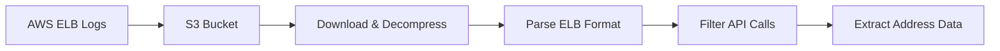
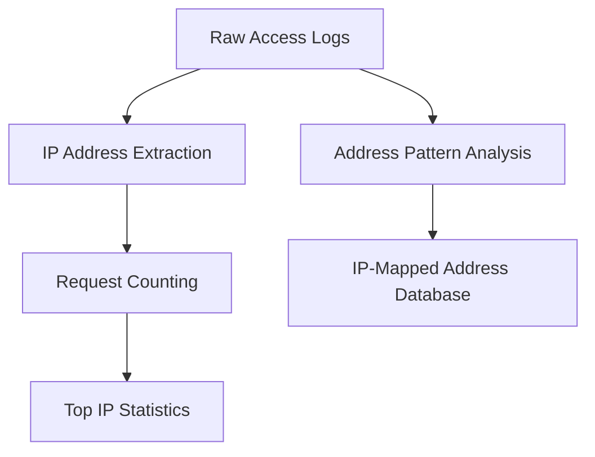
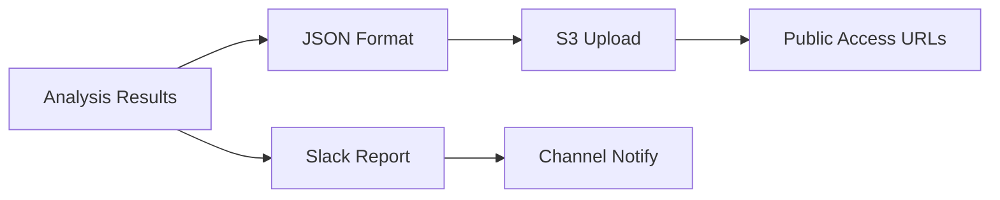

# Analytics Service 概要・ドキュメント

## 🏗️ **サービス構成概要**

本社Analytics Serviceは、Blockscoutバックエンドとは独立して運営される統計・分析専用サービスです。

### 📁 **ディレクトリ構造**
```
blockscout-v8-backend/
├── analytics/                     # Analytics専用モジュール
│   ├── docker-compose.yml        # 独立Docker Compose設定
│   ├── scripts/
│   │   ├── access-log-analyzer.sh    # アクセスログ解析スクリプト
│   │   └── run-daily-analysis.sh     # 日次スケジューラー
│   ├── docker-compose/
│   │   └── env-example-access-log.txt # 環境変数テンプレート
│   └── README.md                    # ドキュメント
└── run-analytics.sh              # 便利なサービス制御スクリプト
```

### 🎯 **主要機能**
- **API v2/addresses監視**: `/api/v2/addresses/{address}`エンドポイントへのアクセス分析
- **IP統計レポート**: トップ10 IPアドレス別リクエスト数
- **アドレスパターン追跡**: IP毎のユニークアドレスアクセス履歴
- **日次自動分析**: 毎日午前2時自動実行
- **Slack通知**: 分析結果の自動レポート送信

## 🔧 **動作メカニズム**

### 1. **ログ収集プロセス**


**詳細ステップ:**
1. **S3ログダウンロード**: 前日のアクセスログを自動ダウンロード
2. **Gzip解凍**: 圧縮ログファイルを自動解凍
3. **ELB書式解析**: Tab区切りレコードを解析
4. **API呼び出し抽出**: `/api/v2/addresses/{address}`のリクエストのみ抽出

### 2. **データ分析プロセス**


**分析項目:**
- **IP別リクエスト数**: 最も多くアクセスしたIPアドレス上位10位
- **ユニークアドレス数**: IP毎にアクセスしたユニークアドレス数
- **アクセスパターン**: IP毎のアドレスアクセス履歴

### 3. **レポート生成・配信**


## 📊 **レポート形式**

### **Slack日次レポート**
```
📊 Daily Access Log Analysis

Top IPs by Request Count:
• 192.168.1.1: 1,245 requests
• 10.0.0.5: 987 requests  
• 203.0.113.42: 654 requests

Analysis Files:
• Top IPs: https://s3.ap-northeast-1.amazonaws.com/bucket/...
• Address Patterns: https://s3.ap-northeast-1.amazonaws.com/bucket/...
• Raw Data: https://s3.ap-northeast-1.amazonaws.com/bucket/...
```

### **S3保存ファイル**
- `analysis/access-logs/YYYY-MM-DD/access_analysis.txt`: IP統計サマリー
- `analysis/access-logs/YYYY-MM-DD/address_patterns.json`: アドレスパターンマップ
- `analysis/access-logs/YYYY-MM-DD/parsed_access_logs.csv`: 処理済みデータ

## 🚀 **運用方法**

### **サービス起動**
```bash
# Analyticsサービスの起動
./run-analytics.sh start

# サービス状況確認
./run-analytics.sh status

# ログ監視
./run-analytics.sh logs
```

### **即座実行・テスト**
```bash
# テスト実行
./run-analytics.sh test

# 特定日付の分析実行
./run-analytics.sh analyze 2025-09-01

# コンテナ内シェルアクセス
./run-analytics.sh shell
```

### **設定管理**
```bash
# 環境変数ファイル作成
cp analytics/docker-compose/env-example-access-log.txt analytics/.env

# 設定編集
nano analytics/.env
```

## ⚙️ **設定パラメータ**

### **必須環境変数**
```bash
S3_ACCESS_LOG_BUCKET=l1-mainnet-alb-access-logs-d3rsyke1    # ELBログバケット
S3_ERROR_LOGS_BUCKET=oasys-blockscout-error-logs-bucket      # 結果保存バケット
SLACK_WEBHOOK_URL=https://hooks.slack.com/services/...       # Slack Webhook
AWS_REGION=ap-northeast-1                                   # AWSリージョン
```

### **オプション設定**
```bash
S3_ACCESS_LOG_PREFIX=AWSLogs/428784263071/elasticloadbalancing/ap-northeast-1
S3_ANALYSIS_PREFIX=analysis/access-logs
AWS_SKIP_AWS_CHECK=false
SLACK_CHANNEL=#alert-oasys
SLACK_USERNAME=Access Log Analyzer
```

## 🔒 **セキュリティ設計**

### **GitHub互換性**
- ✅ **シークレット除外**: Slack Webhook URLはハードコーディングされていない
- ✅ **環境変数ベース**: `SLACK_WEBHOOK_URL=${SLACK_WEBHOOK_URL}`形式
- ✅ **Git安全**: コミット履歴にシークレット情報なし

### **AWS認証**
- 🔐 **ボリュームマウント**: `~/.aws:/root/.aws:ro`で安全な認証情報アクセス
- 🔐 **IAM権限**: S3読み取り・書き込み権限のみ最小限

## 📈 **パフォーマンス特性**

### **リソース制限**
```yaml
deploy:
  resources:
    limits:
      cpus: '0.1'      # CPU使用率10%未満
      memory: 100M      # メモリ使用量100MB未満
    reservations:
      cpus: '0.05'      # CPU予約5%
      memory: 50M       # メモリ予約50MB
```

### **実行タイミング**
- ⏰ **日次実行**: 午前2時自動実行
- ⏰ **レトライ機能**: 失敗時3回まで自動再試行
- ⏰ **スケジューリング**: Docker container内で永続稼働

## 🎛️ **トラブルシューティング**

### **よくある問題**
1. **AWS認証エラー**
   ```bash
   # AWS認証情報確認
   aws sts get-caller-identity
   ```

2. **S3アクセスエラー**
   ```bash
   # バケット存在確認
   aws s3 ls s3://l1-mainnet-alb-access-logs-d3rsyke1/
   ```

3. **Slack通知エラー**
   ```bash
   # Webhook URL確認
   curl -X POST -H 'Content-type: application/json' --data '{"text":"test"}' $SLACK_WEBHOOK_URL
   ```

### **ログ確認方法**
```bash
# Analyticsサービスログ
./run-analytics.sh logs

# Dockerコンテナ状況
docker compose -f analytics/docker-compose.yml ps

# リソース使用状況
docker stats access-log-analyzer
```

## 💡 **運用ガイドライン**

### **定期メンテナンス**
- 📅 **週次**: S3パブリックアクセスポリシー確認
- 📅 **月次**: ELBログ保存期間・分析結果アーカイブ
- 📅 **四半期**: IPパターン分析によるセキュリティレポート作成

### **アラート設定**
- 🚨 **分析失敗**: 3回連続失敗時の緊急通知設定推奨
- 🚨 **異常アクセス**: 単一IPからの急激なアクセス増加監視
- 🚨 **API異常**: 400/500エラー率の増加監視

このAnalytics Serviceは、Blockscoutインフラストラクチャの重要な監視・分析ツールとして設計されており、独立したモジュールとして安心して運用できる構成となっています。
